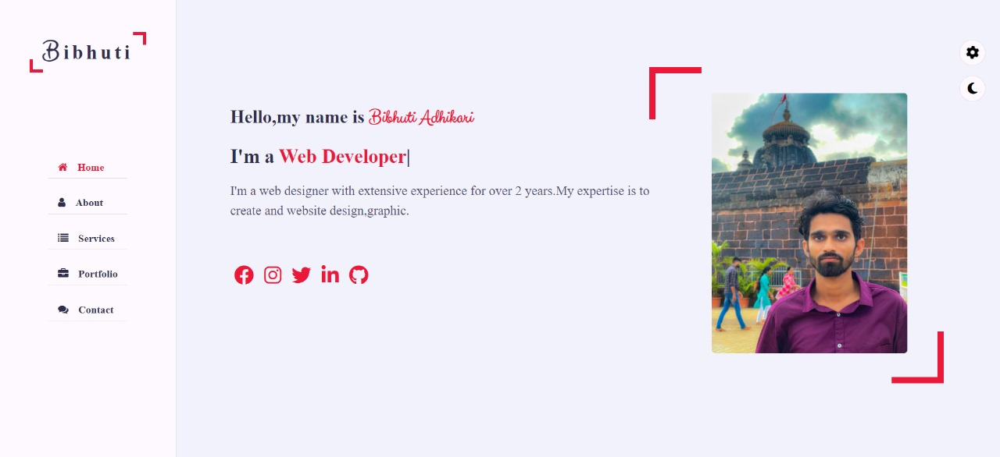

# 🌐 Personal Portfolio Website

A fully responsive personal portfolio website built with 
HTML, CSS and JavaScript.

## 📸 Preview

## ✨ Features
- Fully responsive — mobile, tablet and desktop
- Smooth animations and modern design
- About, Skills, Projects and Contact sections
- Contact form
- Social media links

## 🛠️ Technologies Used
- HTML5
- CSS3
- JavaScript

## 🔗 Live Demo
👉 [bibhutiportfolio.vercel.app](https://bibhutiportfolio.vercel.app)

## ▶️ How to Run
Download the files and open index.html in your browser.

## 👤 Author
Bibhuti Adhikari — [bibhutiportfolio.vercel.app](https://bibhutiportfolio.vercel.app)

